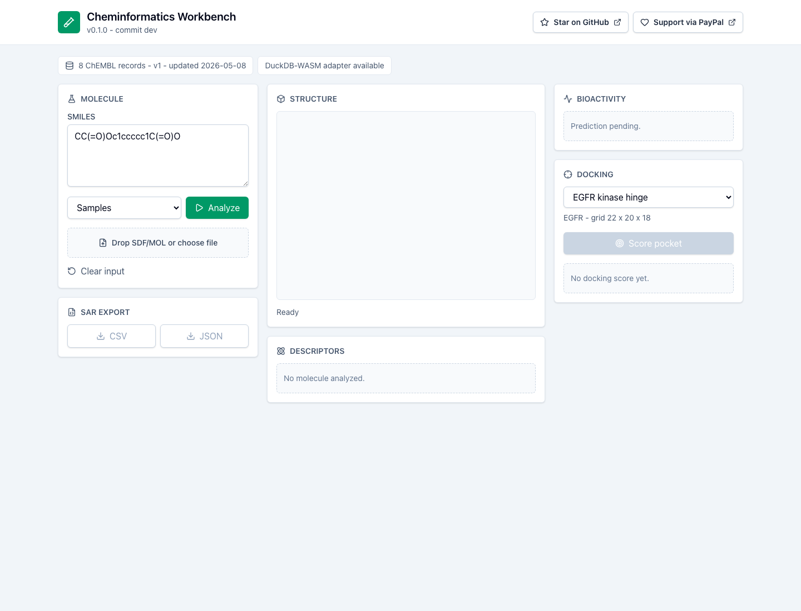
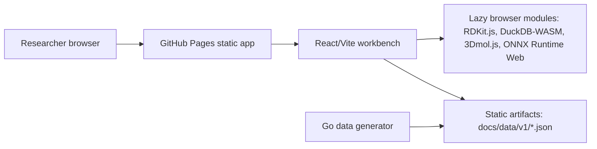

# Cheminformatics Workbench

https://baditaflorin.github.io/cheminformatics-workbench/

Browser-first molecular workbench for descriptors, bioactivity prediction, docking-style screening, and 3D visualization. The app is published from `docs/` on GitHub Pages and uses a Mode B static data pipeline instead of a runtime backend.

Repository: https://github.com/baditaflorin/cheminformatics-workbench

Support: https://www.paypal.com/paypalme/florinbadita

## Badges

Live site: https://baditaflorin.github.io/cheminformatics-workbench/

Version: `0.2.0`

## Demo



## Quickstart

```bash
npm install
make data
make dev
make test
make build
```

## What Works In v0.2.0

- SMILES text input and SDF/MOL upload.
- Browser-side descriptor calculation with RDKit.js available for molblock conversion.
- Static ChEMBL subset, receptor metadata, and bioactivity model generated by Go into `public/data/v1` and `docs/data/v1`.
- Bioactivity prediction, nearest local ChEMBL records, docking-style score, 3Dmol.js viewer, and CSV/JSON SAR export.
- Visible GitHub star link, PayPal link, version, and live commit in the page header.

## Architecture



See `docs/architecture.md` and `docs/adr/`.

## Commands

```bash
make help
make install-hooks
make lint
make smoke
make pages-preview
```

## Deployment

GitHub Pages serves the `docs/` directory from `main`.

Live URL: https://baditaflorin.github.io/cheminformatics-workbench/

Deploy guide: `docs/deploy.md`
