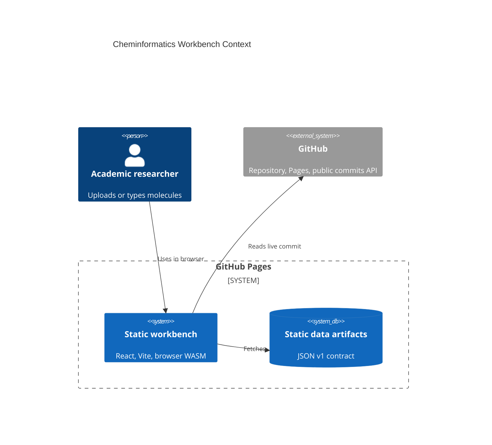
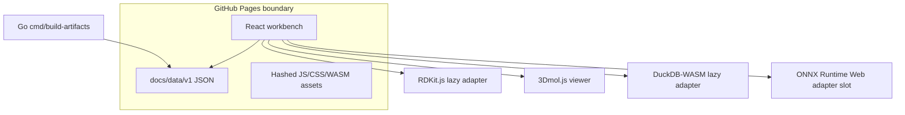

# Architecture

## Context

```mermaid
C4Context
  title Cheminformatics Workbench Context
  Person(researcher, "Academic researcher", "Uploads or types molecules")
  System_Boundary(pages, "GitHub Pages") {
    System(app, "Static workbench", "React, Vite, browser WASM")
    SystemDb(data, "Static data artifacts", "JSON v1 contract")
  }
  System_Ext(github, "GitHub", "Repository, Pages, public commits API")
  Rel(researcher, app, "Uses in browser")
  Rel(app, data, "Fetches")
  Rel(app, github, "Reads live commit")
```

## Container

```mermaid
flowchart TB
  subgraph "GitHub Pages boundary"
    App["React workbench"]
    StaticData["docs/data/v1 JSON"]
    Assets["Hashed JS/CSS/WASM assets"]
  end
  Go["Go cmd/build-artifacts"] --> StaticData
  App --> StaticData
  App --> RDKit["RDKit.js lazy adapter"]
  App --> Viewer["3Dmol.js viewer"]
  App --> DuckDB["DuckDB-WASM lazy adapter"]
  App --> ONNX["ONNX Runtime Web adapter slot"]
```

The v1 app has no runtime server. All user molecules remain in the browser unless the user exports them.
